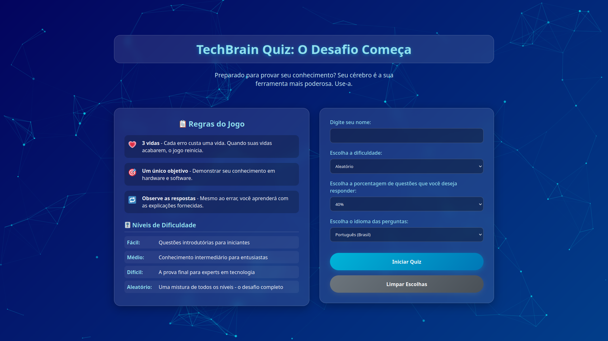
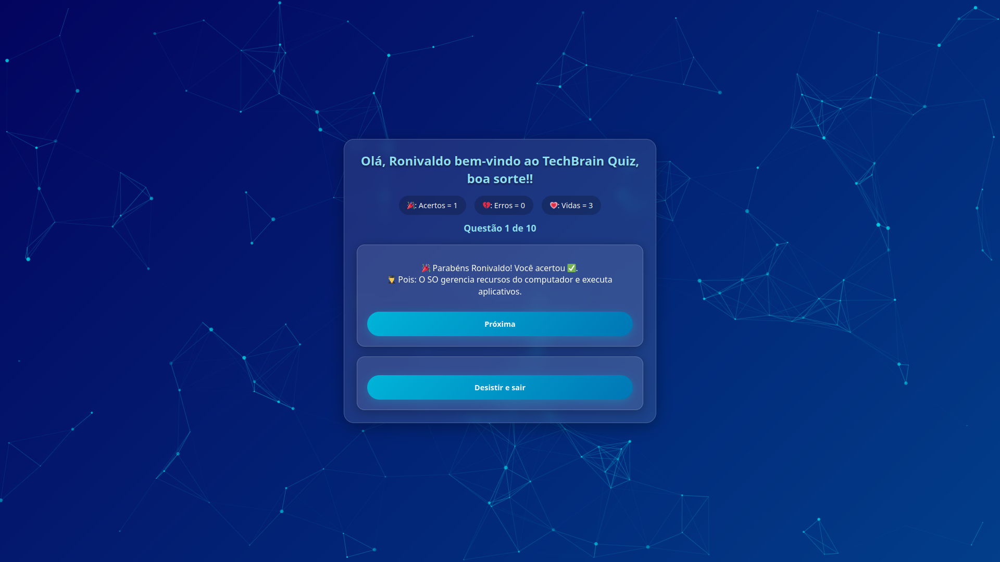
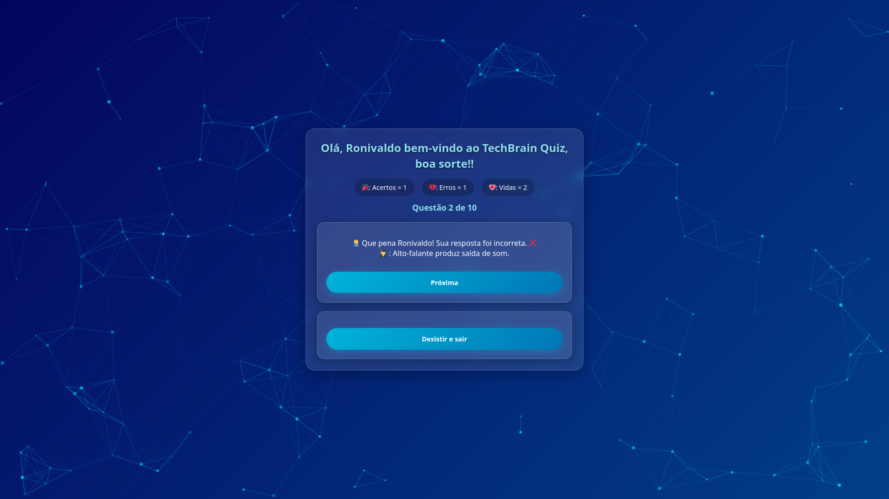
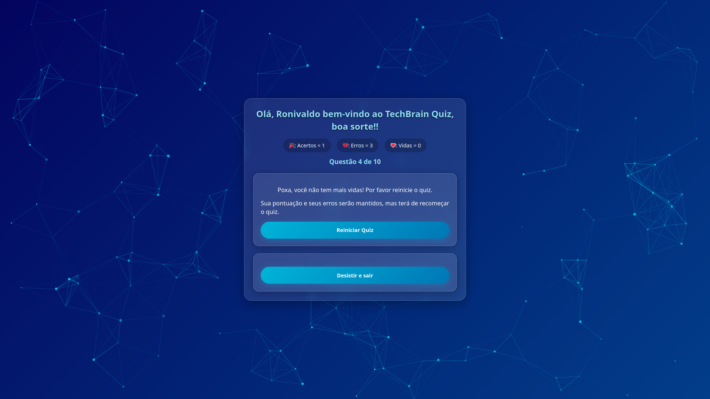
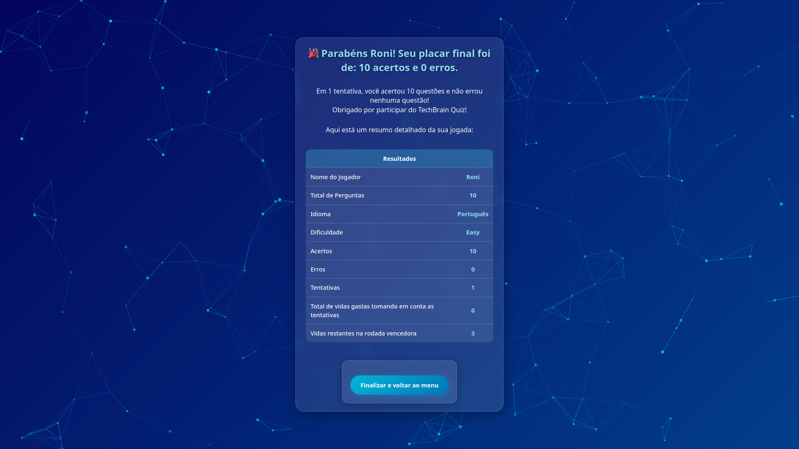

# TechBrain Quiz

## Sobre o Projeto

O **TechBrain Quiz** é um jogo de perguntas e respostas desenvolvido em **PHP**, sem banco de dados ou armazenamento externo.  
Foi criado como primeiro trabalho da disciplina de **Desenvolvimento Backend** do curso de ADS.

- **Tema:** Hardware e Software  
- **Níveis de Dificuldade:** Fácil, Médio, Difícil e Aleatório  
- **Idiomas:** Português e Inglês  
- **Objetivo:** Demonstrar conhecimento em hardware e software, aprendendo com feedback e explicações das respostas.

---

## Funcionalidades

- Registro do nome do jogador  
- Escolha de dificuldade e idioma  
- Seleção da porcentagem de perguntas a serem respondidas  
- Sistema de pontuação e vidas (3 vidas)  
- Feedback imediato e explicação em cada resposta  
- Reinício do quiz ao zerar vidas, mantendo progresso de tentativas  
- Interface interativa com partículas e efeitos visuais  

---

## Regras do Jogo

1. O jogador começa com 3 vidas.  
2. O objetivo é acertar o maior número de perguntas possível.  
3. Ao errar, observe a explicação da resposta para aprender.  
4. Quando as vidas se esgotam, o quiz reinicia.  
5. A porcentagem de perguntas escolhida influencia diretamente no número de questões a serem respondidas.  

---

## Estrutura do Projeto

```bash
tech-brain-quiz
├── docs
│   ├── img                     # Imagens explicativas do quiz
│   └── proposta_quiz_backend.pdf
├── LICENSE
├── public                       # Pasta acessível pelo navegador
│   ├── api
│   ├── assets
│   ├── index.php
│   └── quiz.php
├── README.md
├── src                          # Pasta protegida, não acessível pelo navegador
│   ├── backend
│   └── data
└── tests
```

---

## Estrutura do Array de Questões

Os arrays de questões (`questions_pt_br.php` e `questions_en_us.php`) seguem esta estrutura **obrigatória**:

```php
$questions = [
    'easy' => [ /* perguntas fáceis */ ],
    'medium' => [ /* perguntas médias */ ],
    'hard' => [ /* perguntas difíceis */ ]
];
```

> O array pode ser expandido ou alterado, mas a **estrutura deve ser mantida**.

---

## Como Usar o Projeto

### PHP embutido

```bash
git clone https://github.com/ronidomingues/tech-brain-quiz.git
cd tech-brain-quiz
php -S localhost:8000 -t public
```

Abra o navegador em `http://localhost:8000`.

### Usando Apache

1. Adicione um **VirtualHost** apontando para a pasta `public`:

```apache
<VirtualHost *:80>
    ServerName quiz.local
    DocumentRoot "/caminho/para/tech-brain-quiz/public"

    <Directory "/caminho/para/tech-brain-quiz/public">
        Options Indexes FollowSymLinks
        AllowOverride All
        Require all granted
    </Directory>
</VirtualHost>
```

2. Adicione no `hosts`: `127.0.0.1 quiz.local`;
3. Reinicie Apache: `sudo systemctl restart apache2`;
4. Acesse `http://quiz.local`;

---

## Telas do Quiz

### Tela inicial



### Tela de questões


### Tela de acerto



### Tela de erro



### Tela de reinício da partida



### Tela final do quiz



---

## Contato

- **E-mail:** ronidomingues@poli.ufrj.br
- **Linkedin:** [ronidomingues](https://www.linkedin.com/in/ronidomingues/)
- **GitHub:** [ronidomingues](https://github.com/ronidomingues)

---

## Licença

Este projeto é licenciado sob a **MIT License**. [Mais informações](https://github.com/ronidomingues/tech-brain-quiz/blob/main/LICENSE)

---

## Considerações Finais

O projeto pode ser expandido com novas funcionalidades, melhorias visuais e novos temas de perguntas. Durante o desenvolvimento surgiram várias ideias para futuras implementações as quais ainda não me sinto confortável em implementar.
